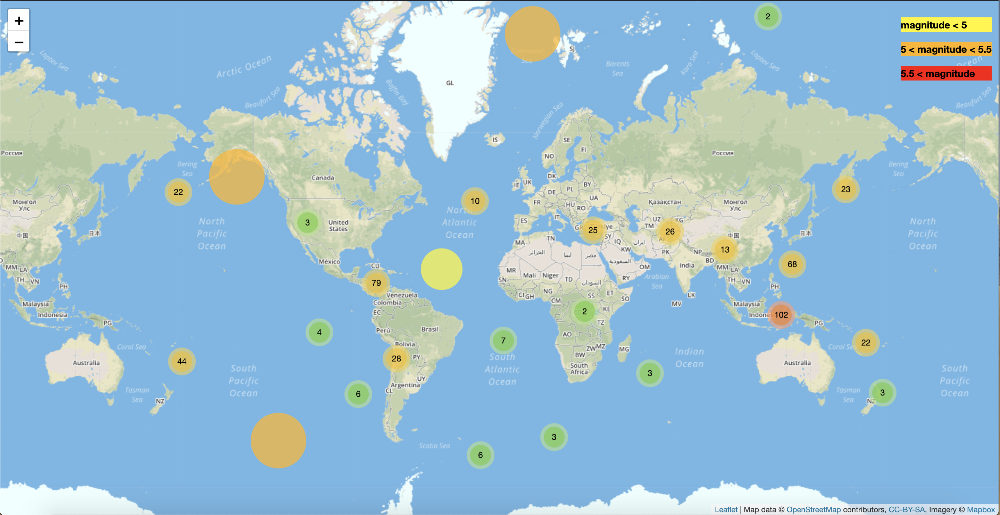
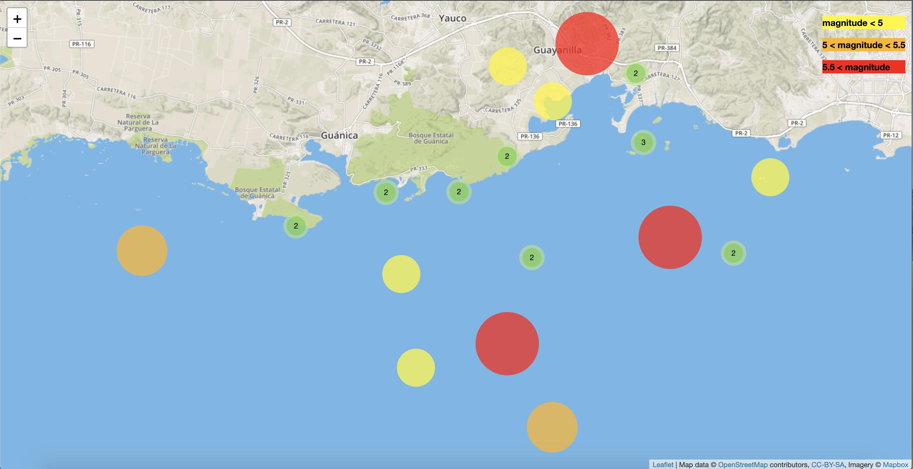
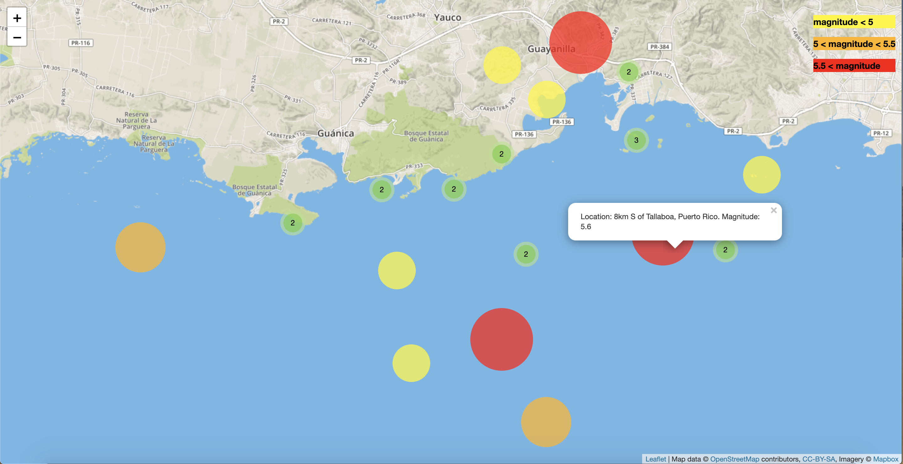

# leaflet-challenge
# This homework takes data about earthquakes in the past 30 days and represents it in a map, the following are pictures of how it looks: 
# MAP:

# COLORS DEPENDING ON MAGNITUDE

# LABEL SHOWING INFO ABOUT LOCATION AND MAGNITUDE ON CLICK

